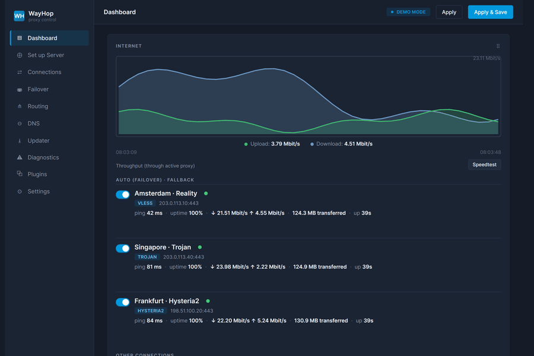
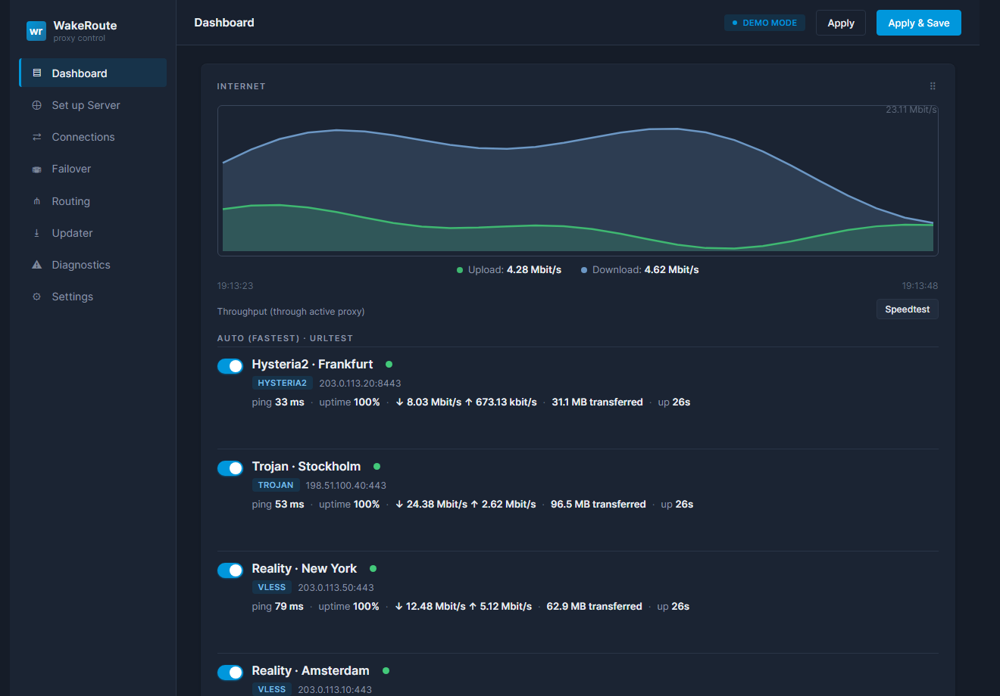
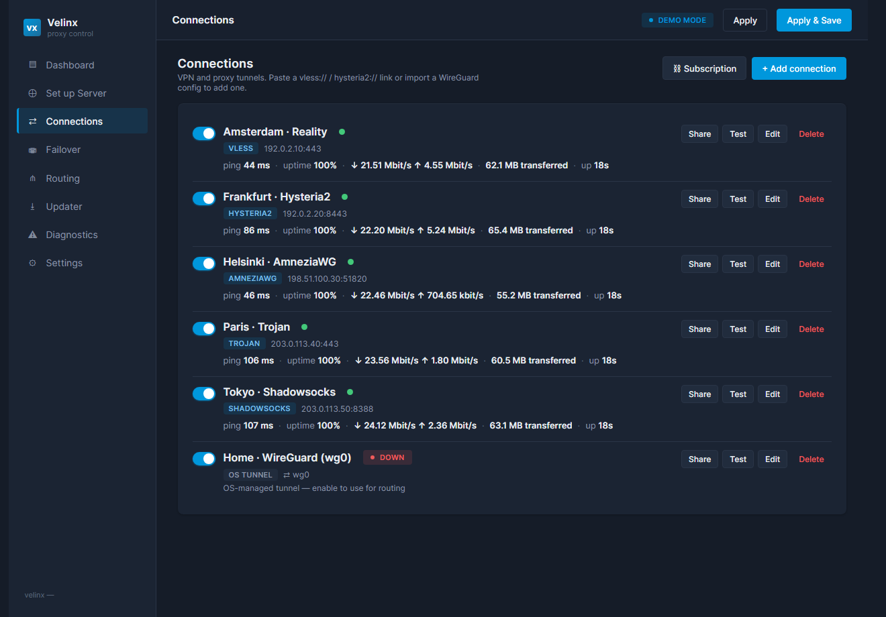
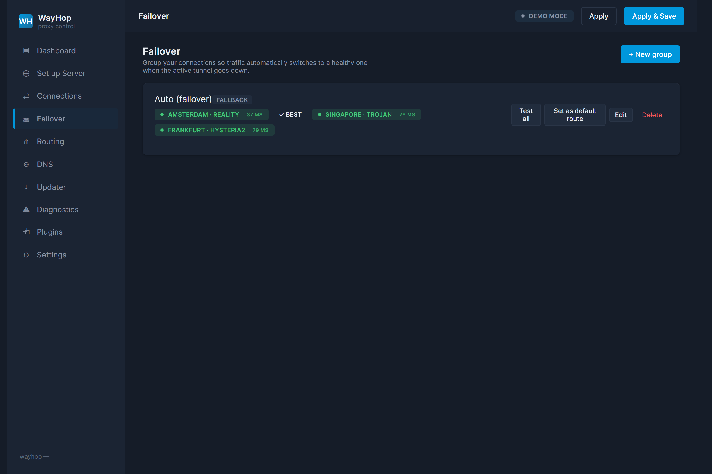
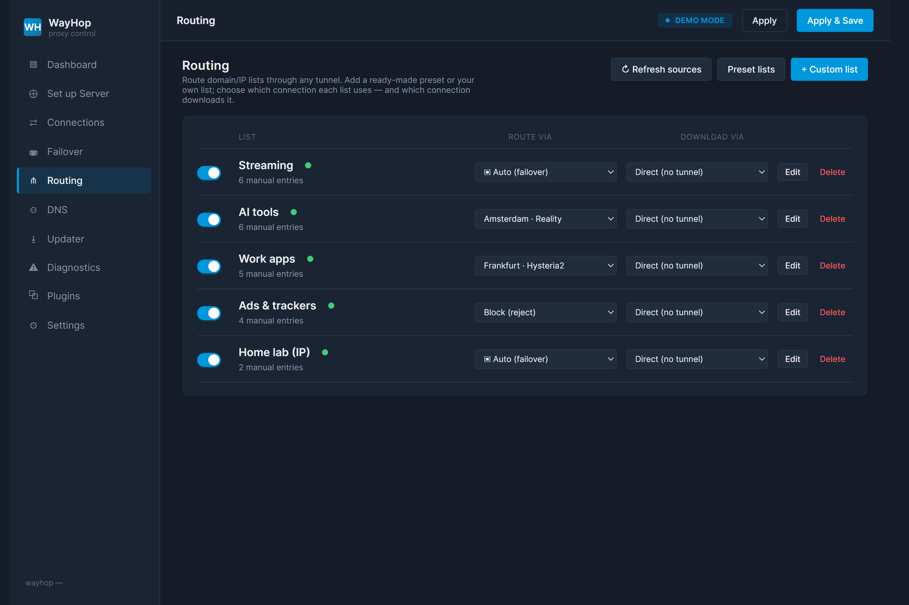
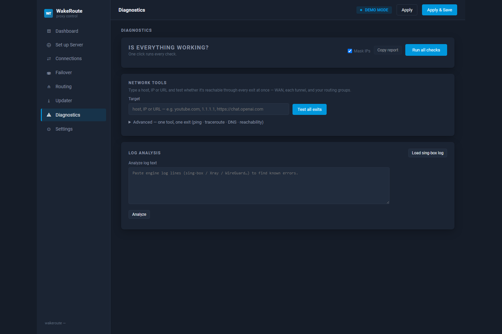

<div align="center">


**Run any modern VPN/proxy protocol on your router — from one clean web panel, with automatic failover.**

[](LICENSE)
[](../../releases/latest)
[](go.mod)
[](#install)
[](#install)

</div>

<div align="center">



</div>

WayHop is a **single static Go binary** (the web UI is embedded) that turns [sing-box](https://github.com/SagerNet/sing-box) into a router admin panel. Stock firmware gives you WireGuard and OpenVPN — WayHop adds the modern censorship-resistant stack (**VLESS-Reality, Hysteria2, TUIC, AmneziaWG**), one-click **failover groups**, list-based **selective routing**, live **traffic graphs**, and a one-click **diagnostics battery** — all on its own port, without touching your router's native VPN config.

> **No more hand-edited sing-box JSON, policy-routing scripts, and SSH.** Paste a share link, pick a failover order, hit Apply — and if anything breaks connectivity, it rolls back on its own.

---

## ✨ Highlights

| | |
|---|---|
| 🔌 **Any protocol, one panel** | Import VLESS-Reality, Hysteria2, TUIC, Trojan, VMess, Shadowsocks, WireGuard, AmneziaWG, and olcRTC from a share link, a `.conf` file, or a subscription URL. |
| 🔁 **Smart failover & health** | Auto-select the fastest working endpoint (`urltest`), manual selector, or strict ordered fallback — with live latency, success-rate, uptime, and **probable failure cause** read from the engine logs. |
| 🧭 **Selective routing, 20+ presets** | Route per destination by domain / IP / geo / port. One-click curated rule-sets (unblock RU sites, route Discord/Telegram/YouTube, block ads), or your own lists — with **auto-refreshing IP carve-outs** from CIDR/ASN feeds. |
| ⚡ **Native-first kernel routing** | Let the kernel route WireGuard/AmneziaWG and IP carve-outs at full speed; sing-box handles only the obfuscation protocols. *(new in 0.3.0: a kernel-PBR backend for **Keenetic**, which ships no nftables.)* |
| 🛟 **Fail-safe Apply** | Changes go live **until reboot** unless you Save. Lose connectivity and WayHop auto-reverts the previous config; optional guarded auto-reboot as a last resort. |
| 🩺 **One-click diagnostics** | Ping, traceroute, DNS-leak, IPv6-leak, DoH reachability, clock-skew, config validation, and live engine-log tailing — with fixes suggested from a built-in knowledgebase. |
| 📈 **Live dashboard** | Real-time traffic graph, per-tunnel latency sparklines, top-talkers, grouped connections by destination IP, RAM/CPU/uptime, and your public exit IP. |
| 🔒 **Hardened by default** | SSRF-guarded subscription fetches, same-origin (CSRF) guard, CSP `script-src 'self'`, clickjacking/`nosniff`/referrer headers, a 16 MiB body cap, and an optional Host allow-list. |

<div align="center">

</div>

<details align="center">
<summary><b>📸 More screenshots</b></summary>

| Connections | Failover |
|:---:|:---:|
|  |  |
| **Routing** | **Diagnostics** |
|  |  |

</details>

---

## 📡 Protocol support

| Protocol | Transport / mode | Import from | Engine |
|---|---|---|---|
| **VLESS** (+ Reality) | TCP · WebSocket · gRPC · HTTP/2, Reality or TLS, uTLS | link · subscription · form | sing-box |
| **VMess** | WebSocket · gRPC · mKCP · h2 | link · subscription · form | sing-box |
| **Trojan** | TLS (+ WebSocket / gRPC) | link · subscription · form | sing-box |
| **Shadowsocks** | AEAD ciphers · SS-2022 | link · subscription · form | sing-box |
| **Hysteria2** | QUIC, Salamander obfs, port-hopping | link · subscription · form | sing-box |
| **TUIC v5** | QUIC, BBR/cubic, UDP relay | link · subscription · form | sing-box |
| **WireGuard** | UDP (kernel-native routing) | `.conf` · link · form | sing-box / kernel |
| **AmneziaWG** | WireGuard + junk-packet obfuscation | `.conf` · form | `amneziawg-go` plugin |
| **olcRTC** | TCP-over-WebRTC (anti-whitelist) | YAML · form | olcRTC plugin |
| **nfqws** | DPI-desync on the **direct** path (not a tunnel) | — | nfqws plugin |

Subscriptions auto-detect base64 vs. plain text, import each link independently (one bad link doesn't sink the batch), and de-duplicate by name.

---

## 🚀 Install

WayHop runs on **OpenWrt** (native `procd`) and on **Keenetic / generic Entware** (busybox `/opt`) — CPU: MIPS (little/big-endian), ARMv7, ARM64, or x86-64.

### Quick install — one command

SSH into the router and run. This auto-detects your CPU arch + platform, downloads the latest release, **verifies its SHA-256**, and launches the interactive installer:

```sh
curl -fsSLO https://github.com/awadak3davra/wayhop/releases/latest/download/bootstrap.sh && sh bootstrap.sh
```

No `curl` on the router? Swap in `wget -qO bootstrap.sh https://github.com/awadak3davra/wayhop/releases/latest/download/bootstrap.sh && sh bootstrap.sh` — the script uses whichever downloader you have. Forward installer flags after a `--` (e.g. `sh bootstrap.sh -- -y --port 8089`); if auto-detect guesses wrong, override with `--arch mipsle` or `--openwrt` / `--entware`.

The installer is **interactive and safe to run on a live router** — it pre-flights everything before touching anything:

- ✅ **System & router status** — arch (incl. MIPS endianness), free flash space, RAM, uptime, internet reachability, and clock/NTP (Reality/TLS need an accurate clock).
- ✅ **Dependencies** — `ip` / `ipset` / `iptables` / `opkg` / `sing-box`, with an offer to `opkg install` what's missing.
- ✅ **Conflict detection + one-tap fixes** — it finds whatever already holds the UI port (**lighttpd** on stock Keenetic firmware is the usual culprit), an existing **selective-routing tool**, a stray sing-box, or a previous install, and **asks before disabling each one** (or just moves WayHop to a free port).
- ✅ **Atomic install** — staged binary swap with a single rolling backup, then a health check on the UI.

Then open **`http://<router-ip>:8088`**. To remove it later: `sh /opt/etc/wayhop/uninstall.sh` (add `--purge` to delete the config too) — the installer saves the uninstaller there so it survives reboots.

<details>
<summary><b>Manual install — pick your own tarball</b></summary>

Grab the tarball for your router from the [**Releases**](../../releases/latest) page — each CPU arch ships in two flavours:

| Your router's `uname -m` | Arch | Entware / Keenetic | OpenWrt |
|---|---|---|---|
| `mips` (little-endian, most MT7621) | `mipsle` | `wayhop-<ver>-mipsle.tar.gz` | `…-mipsle-openwrt.tar.gz` |
| `mips` (big-endian) | `mips` | `wayhop-<ver>-mips.tar.gz` | `…-mips-openwrt.tar.gz` |
| `armv7l` | `arm` | `wayhop-<ver>-arm.tar.gz` | `…-arm-openwrt.tar.gz` |
| `aarch64` | `arm64` | `wayhop-<ver>-arm64.tar.gz` | `…-arm64-openwrt.tar.gz` |
| `x86_64` | `amd64` | `wayhop-<ver>-amd64.tar.gz` | `…-amd64-openwrt.tar.gz` |

**Keenetic / Entware** (`/opt`, SSH) — download the tarball for your arch into `/tmp`, then:

```sh
cd /tmp
mkdir -p wr && tar -xzf wayhop-*.tar.gz -C wr && cd wr
sh ./install.sh
```

Useful flags: `--dry-run` (run every check, change nothing), `-y` (assume yes), `--port 8089` (use a different UI port), `--arch mipsle` (force arch), `--no-start`.

**OpenWrt** (`procd`) — the one-liner above works on-device; if you'd rather push from a workstation, busybox has no `scp`, so stream the `-openwrt` tarball in over SSH:

```sh
ssh root@192.168.1.1 "cat > /tmp/wr.tgz" < wayhop-<ver>-<arch>-openwrt.tar.gz
ssh root@192.168.1.1 "mkdir -p /tmp/wr && tar -xzf /tmp/wr.tgz -C /tmp/wr && cd /tmp/wr && sh ./install.sh"
```
</details>

<details>
<summary><b>Build from source</b></summary>

Requires Go 1.22+. The UI is embedded in the binary, so a UI change needs a rebuild.

```powershell
./build.ps1            # Windows: cross-compile + package every arch into dist\
```
```sh
make package           # the same, on a Unix build host
```

Single-arch, by hand:

```sh
CGO_ENABLED=0 GOOS=linux GOARCH=arm64 go build -trimpath \
  -ldflags "-s -w -X wayhop/internal/version.Version=0.5.2" \
  -o wayhop-arm64 ./cmd/wayhop
```

Run the demo UI locally (synthetic data, no sing-box needed):

```sh
go run ./cmd/wayhop --demo --listen 127.0.0.1:8088
```
</details>

---

## 🆕 What's new in 0.5.0

- **New name: WayHop** — the project formerly known as Velinx is now **WayHop**. Same tool, clearer brand. On upgrade the installer migrates your existing config and runtime state automatically (older WakeRoute installs migrate too).
- **IPTV plugin** — build a filtered, de-duplicated M3U playlist from public country / language / category catalogs, your own list URLs, or Xtream Codes accounts, served at a private token URL. A catalog picker — the same browse-and-add UX as the routing-list catalog — makes public sources one click; pin and keep categories, optionally probe streams for liveness, and merge EPG guide data. Credentials in Xtream / list URLs never reach logs or the UI.
- **Every language, fully translated** — the panel *and* the new IPTV plugin ship complete translations across all 13 supported languages, with a CI guard that blocks a missing key or a dropped placeholder from ever shipping.
- **Lighter on RAM** — the daemon caps its own heap so it stays small on tight routers.

See the [changelog](CHANGELOG.md) for the full 0.4.x / 0.3.x release history.

---

## 🧱 Architecture

```
                       ┌─────────────────────────────────────────────┐
   browser ──:8088──▶  │  wayhop daemon  (one Go binary, UI baked in) │
                       │   • model → config   • health probes            │
                       │   • fail-safe Apply   • REST + Clash API client │
                       └───────┬───────────────────────┬─────────────────┘
                               │ writes config          │ live traffic / latency
                               ▼                         │ (Clash API :9090)
                         ┌──────────────┐                │
                         │   sing-box   │◀───────────────┘
                         │  (universal  │   VLESS-Reality · Hy2 · TUIC · VMess · …
                         │    core)     │
                         └──────┬───────┘
              kernel plane      │ engine plugins (gaps only)
        ┌─────────────────┐     ├──▶ amneziawg-go   (AmneziaWG)
   LAN ─┤ fwmark + ip rule│     └──▶ olcrtc         (WebRTC tunnel)
        │  WG/AWG · WAN   │
        │  IP carve-outs  │   One core handles ~90% of protocols; dedicated binaries
        └─────────────────┘   fill the gaps. In hybrid mode the kernel routes
                              WireGuard/AmneziaWG + IP carve-outs at native speed,
                              and only obfuscation flows enter sing-box.
```

**Failover** is a first-class object built on sing-box `urltest`, watched by a daemon watchdog that autostarts the core and crash-restarts it with backoff. **Routing** coexists with an existing policy-routing setup via a dedicated fwmark + table — it only steers the traffic it marks.

---

## 🔒 Security model

**WayHop is a router LAN admin panel.** It binds `:8088` without a login, treating any LAN-connected user as a trusted operator — the same assumption stock router UIs (LuCI, the Keenetic UI) make.

> [!IMPORTANT]
> **Do not expose `:8088` to the internet.** It has no auth and returns secrets (keys, credentials) to its own UI for editing. For remote access, reach the router over a VPN, or front the panel with TLS + authentication (e.g. a reverse proxy).

Within that LAN-trust boundary the daemon still hardens against realistic LAN-adjacent attacks (a malicious page open in a LAN browser, request forgery, resource exhaustion):

- **SSRF guard** — subscription URLs can't be turned into requests against the router's own API, other LAN hosts, or cloud metadata (`169.254.169.254`).
- **Same-origin (CSRF) guard** — cross-origin `POST`/`PUT`/`DELETE` are rejected, so another tab can't drive Apply / Rollback / Restart through your browser.
- **CSP + security headers** — `script-src 'self'` (anti-XSS), `X-Frame-Options: DENY` + `frame-ancestors 'none'` (anti-clickjacking), `nosniff`, `Referrer-Policy: no-referrer`.
- **Request-body cap** — 16 MiB, so one oversized request can't OOM a low-RAM router.
- **Optional Host allow-list** — pin `allowed_hosts` in `config.json` as a DNS-rebinding defense (empty by default = allow any).

The panel is unauthenticated and LAN-trust by design: treat anyone who can reach `:8088` as an operator.

---

## ❓ FAQ

<details>
<summary><b>Which routers does it run on?</b></summary>

Anything that runs **OpenWrt** (22.x–25.x, `procd`/`fw4`) or has **Entware** under `/opt` — that includes most **Keenetic** routers running stock firmware with the Entware/OPKG add-on. CPU: MIPS (little/big-endian), ARMv7, ARM64, or x86-64. The installer auto-detects yours.
</details>

<details>
<summary><b>Will it break my stock VPN / firewall config?</b></summary>

No. WayHop runs as its own service on `:8088` and routes only the traffic it explicitly marks (its own fwmark + routing table). It coexists with the stock firewall and with other selective-routing systems — the installer detects those and asks before changing anything.
</details>

<details>
<summary><b>Do I need sing-box?</b></summary>

The UI runs without it, but you need `sing-box` present to **Apply** a proxy config. Install it via `opkg install sing-box` or drop the matching build from the [sing-box releases](https://github.com/SagerNet/sing-box/releases). WireGuard/AmneziaWG can route in the kernel without it.
</details>

<details>
<summary><b>What if an Apply breaks my connection?</b></summary>

Apply is **live-until-reboot** unless you explicitly Save. If connectivity drops, WayHop automatically rolls back to the previous config. As a last resort it can auto-reboot — but only if you opt in.
</details>

---

## 🤝 Contributing & license

Issues and PRs welcome. The codebase is protocol-agnostic at its core: adding a protocol touches `model` → `importer` → `generator` → `exporter`, and validation stays generic. CI runs `go vet` + `go test -race` and cross-builds every router arch on each push.

Licensed under the [MIT License](LICENSE). Built on the work of the MIT/Apache-licensed cores it orchestrates — sing-box, mihomo, xray, and amneziawg.
